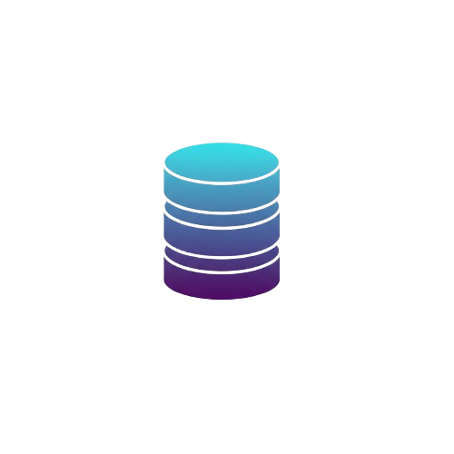

  

<h1 align="center">DBBase</h1>

  <strong>The Professional Database Tooling for VS Code.</strong> 
  Bring the power of DataGrip and DBeaver directly into your favorite editor.

  
  
  

---

**DBBase** is a high-performance, modular VS Code extension designed for developers who need a professional database management experience. Forget switching windows; execute queries, browse schemas, and export data with a native, fluid UI.

## 🚀 Key Features

### 📊 Professional Data Grid

- **High Fidelity:** A grid UI inspired by DataGrip/DBeaver.
- **Inline Editing:** Edit your data directly in the grid and commit changes with a single click.
- **Native Look & Feel:** Fully integrated with VS Code theme variables for a seamless experience.

### 🔍 Schema Explorer

- **Multi-level Hierarchy:** Easily navigate through your connections and tables.
- **Lazy Loading:** High performance even with thousands of tables.
- **Live Status:** Real-time online/offline indicators (🟢/🔴) for every connection.

### 🤖 AI-Ready with Native MCP

- **MCP Server Integration:** Built-in Model Context Protocol (MCP) server.
- **Context for Copilot/Claude:** Give your AI models (GitHub Copilot, Claude Desktop) direct and secure context of your database schema.
- **Semantic Metadata:** Automatically shares table comments and constraints with your AI for smarter query generation.
- **One-Click Setup:** Automatically configures Claude Desktop for you.

### � Key-Value Explorer (Redis)
- **Native Key Browsing:** Explore keys with folder-like organization (using `:` as separator).
- **DataType Support:** Native viewers for Strings, Hashes, Lists, Sets, and Sorted Sets.
- **Direct Editing:** Update values or add fields to Hashes directly in the UI.

### �📥 Enterprise Data Export

Export your query results into multiple professional formats:

- 📑 **Excel (.xlsx)** (Perfect for business reports)
- 📝 **CSV** (Classic data interchange)
- 📄 **JSON** (API-ready formats)
- ⬇️ **Markdown** (Directly for your documentation)
- 💾 **SQL Inserts** (Easy migrations)

### 🛠️ Built for Performance

- **Modular Architecture:** Isolated database drivers (Postgres, MySQL & Redis).
- **Security First:** Uses VS Code's `SecretStorage` for sensitive credentials.
- **Safe Execution:** Automatic protection against accidental data modification.

## 📦 Supported Databases

- ✅ **PostgreSQL**
- ✅ **MySQL / MariaDB**
- ✅ **Redis** (Key-Value Explorer & Editor)
- ⏳ *SQLite (Coming Soon)*
- ⏳ *SQL Server (Coming Soon)*

## ⌨️ Shortcuts

| Command | Shortcut |
| --- | --- |
| **Run Query (at cursor)** | `Ctrl + Enter` / `Cmd + Enter` |
| **New Query Tab** | `dbbase.openQueryEditor` |
| **Save Grid Changes** | `Alt + S` (within grid) |

## 🛠️ Getting Started

1. Install **DBBase** from the Marketplace.
2. Go to the **DBBase Activity Bar** icon.
3. Click the `+` icon to add a new connection.
4. Select your connection and start writing SQL!

### Configuring for AI (Claude Desktop)

1. Ensure your database is connected in DBBase.
2. Open the Command Palette (`Ctrl+Shift+P`).
3. Run `DBBase: Configurar Servidor MCP (Claude Desktop)`.
4. Restart Claude and ask: *"What's in my database?"*

## 📜 License

This project is licensed under the [MIT License](LICENSE).

---

Made with ❤️ for the Database Community

**Enjoy!**
